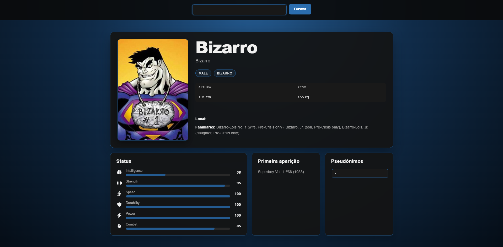

# Heroicos - atividade para uso de API
---

Essa atividade tinha a proposta para aprender a usar APIs, então poderia usar uma da própria preferência para entender o que é e como funciona uma API.

API usada - [Superhero API](https://akabab.github.io/superhero-api/api/)

Essa API de super-heróis faz uma busca por ID, mas com o uso do retorno total do JSON, é possível usar um find e procurar pelo ID e fazer a procura. Esse ID faz retornar:
- ID
- Nome comum
- Nome de pesquisa
- Status de poder
    * Inteligência
    * Força
    * Velocidade
    * Durabilidade
    * Poder
    * Combate
- Aparência
    * Gênero
    * Raça
    * Altura
    * Peso
    * Cor do olho
    * Cor do cabelo
- Biografia
    * Nome completo
    * Alter egos
    * Pseudônimos
    * Local de nascença
    * Primeira aparição
    * Editora
    * Alinhamento
- Trabalho
    * Ocupação
    * Base
- Conexões
    * Afiliações
    * Parentes
- Imagens

A URL chamada na API é [para buscar todos os herois](https://akabab.github.io/superhero-api/api/all.json) e para buscar [um heroi específico](https://akabab.github.io/superhero-api/api/id/1.json) e retornar os dados.

Para rodar essa aplicação com a API precisa apenas baixar os arquivos '.php' e '.js', deixando eles na mesma pasta, e então abrir e rodar no navegador que já irá funcionar corretamente, desde que possua conexão com a internet.

Meu maior problema foi no inicio conectando a API, eu estava meio perdido em relação a usar o 'fetch' e como eu poderia depois puxar os dados, mas depois que entendi e fui fazendo uma, vi que era questão de repetição e de mudar variáveis.